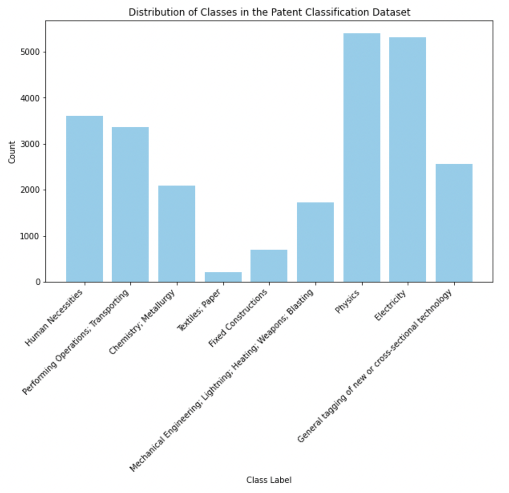
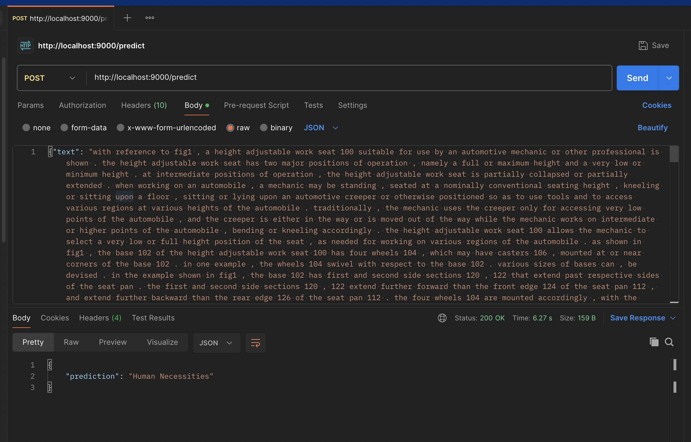
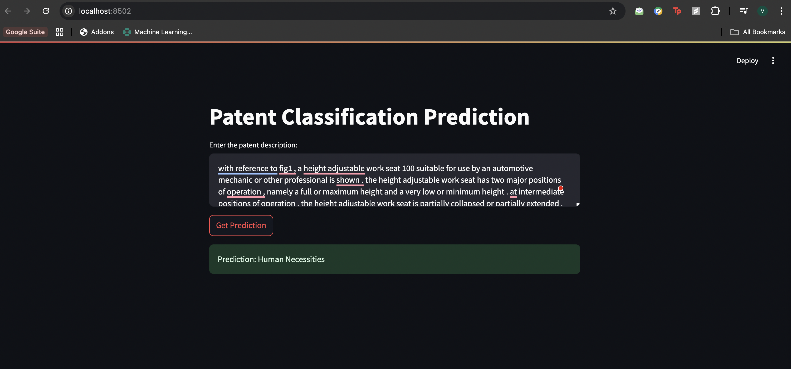
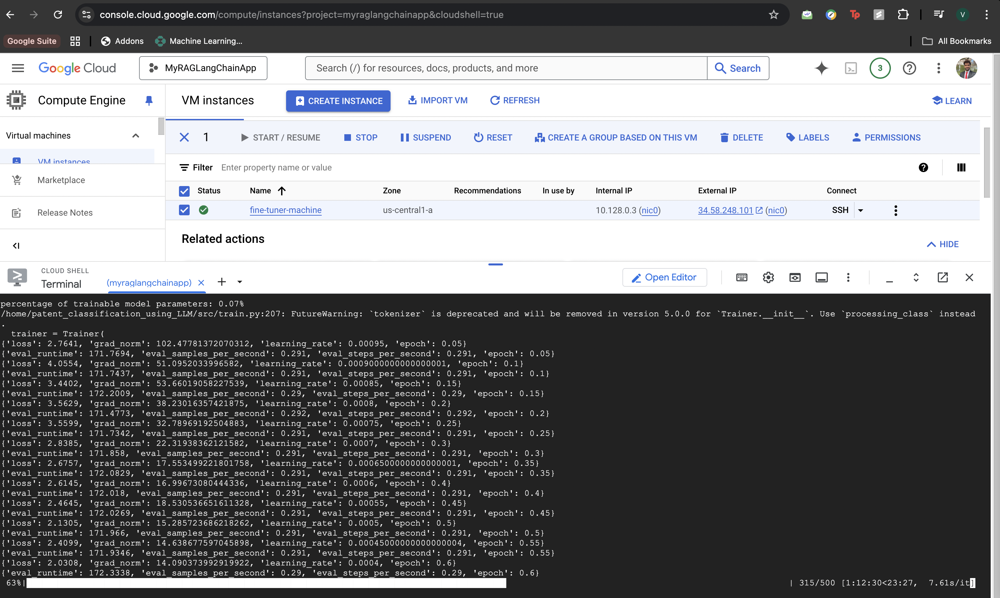

# Patent Classification using Llama 3.2-1B LLM

This project focuses on training a patent classification model using the [PEFT](https://huggingface.co/docs/peft/) (Parameter Efficient Fine-Tuning) method with the LoRA (Low-Rank Adaptation) technique. The model is fine-tuned for patent classification, and it is deployed via a FastAPI backend and a Streamlit frontend to make predictions on patent descriptions. 

## Project Overview

The task involves classifying patent descriptions into one of 9 categories. For efficiency, the PEFT technique using LoRA is applied to a pre-trained Llama-3.2-1B model. The model is fine-tuned on a subset of the `ccdv/patent-classification` dataset and deployed for real-time predictions via a web interface.

## Dataset

The dataset used is the [ccdv/patent-classification](https://huggingface.co/datasets/ccdv/patent-classification) dataset, which consists of patent descriptions categorized into 9 classes:

- Human Necessities
- Performing Operations; Transporting
- Chemistry; Metallurgy
- Textiles; Paper
- Fixed Constructions
- Mechanical Engineering; Lightning; Weapons; Blasting'
- Physics
- F16 Electricity
- General tagging of new or cross-sectional technology

### Data Details:
- **Train records:** 25,000
- **Validation records:** 5,000
- **Test records:** 5,000



Due to time and compute constraints, we are using a subset of 1,000 train records and 100 test records in this project.

## Model Architecture

### LoRA (Low-Rank Adaptation)

In this project, we used **LoRA** (Low-Rank Adaptation) to apply parameter-efficient fine-tuning to the pre-trained Llama-3.2-1B model. LoRA helps improve the efficiency of fine-tuning large models by reducing the number of trainable parameters, focusing on low-rank updates to certain weight matrices in the model. This allows for faster training without compromising performance.

### Why Not Quantization?

Initially, I attempted to use **quantization** (through the `bitsandbytes` library) to reduce the model size for efficient deployment. However, since I used a **CPU** (rather than a GPU with CUDA), quantization didn't work as expected. Quantization relies on hardware acceleration, which is not available on a CPU, hence I had to abandon that approach. If I had access to a **CUDA-enabled GPU**, I could have successfully applied quantization for model compression and efficiency.

**Note: Currently bitsandbytes is only supported on CUDA GPU hardwares, support for AMD GPUs and M1 chips (MacOS) is coming soon.**

### Hyperparameters

- **LoRA Configuration:** 
  - **r = 8:** Rank of the low-rank matrices, determining the number of learnable parameters in LoRA layers.
  - **lora_alpha = 16:** Scaling factor for the LoRA layers, controlling the contribution of the low-rank updates.
  - **lora_dropout = 0.1:** Dropout rate used in LoRA layers to avoid overfitting.

These hyperparameters were selected after experimentation to balance model efficiency and training stability.

## Training Environment

I initially attempted to run the training process on my **MacBook M1 Pro** with 16GB RAM using Apple's **Metal Performance Shaders (MPS)** for hardware acceleration. However, this setup had issues:

- **MPS support**: MPS did not support **float16**, which is critical for efficient model training in deep learning.
- **Memory limitations**: My MacBook had insufficient RAM (16GB) for handling the large model size.

Given these constraints, I deployed a **Google Cloud VM** with **32GB of CPU RAM** to train the model. This configuration allowed me to successfully fine-tune the model.

## Files in the Project

### `src/train.py`

- This script is used to train the model.
- It loads the dataset, tokenizes the text data, prepares the model with LoRA fine-tuning, and trains the model on a CPU.
- The model is saved in the `final_model` directory.

### `src/frontend.py`

- This script serves as the **Streamlit frontend** for the model.
- It allows users to input patent descriptions and get predictions from the backend API.

### `src/serve.py`

- This script runs a **FastAPI server** for model inference.
- The FastAPI server listens for POST requests with a patent description and returns the predicted class.

### `final_model/`

- This directory contains the trained model (including LoRA adapter layers) saved during the training process. It is loaded by the FastAPI server for inference.

## How to Run the Files

### 1. Install Dependencies

Ensure all dependencies are installed before running the scripts. You can install the necessary Python packages by running:

```bash
pip install -r requirements.txt
```

### 2. Training the Model

To train the model, run the following command. This script will fine-tune the pre-trained Llama-3.2-1B model using LoRA and save the trained model to the `final_model` directory.

```bash
python src/train.py
```

### 2. Starting the FastAPI Server
Once the model is trained, you can start the FastAPI server to serve the model for inference. Run:
```
bash
uvicorn serve:app --host 0.0.0.0 --port 9000
```
The FastAPI server will start and be hosted at http://localhost:9000. It will accept POST requests with a patent description and return the predicted class.



### 3. Running the Streamlit Frontend
To allow users to input patent descriptions via a web interface, run the Streamlit frontend:

```bash
streamlit run src/frontend.py
```
This will open a browser window with the Streamlit interface where users can input patent descriptions and receive predictions from the model.



## Deployment on Google Cloud for Training
To overcome the memory limitations of my local machine, I deployed the training process on a Google Cloud VM with 32GB RAM. This allowed me to fine-tune the Llama-3.2-1B model using PEFT and LoRA. Once the model was trained, I pushed it to GitHub and retrieved it locally to serve on vLLM.




## Evaluation and Performance

During the training process, I encountered an issue where the `compute_metrics` function did not work properly when using the `peft_model` (the model with LoRA adapters). This issue arises because the `Trainer` class does not support `compute_metrics` for PEFT models, as detailed in [this GitHub issue](https://github.com/huggingface/transformers/issues/29186). The issue occurs because the `peft_model` is an adapter-based model, and not the full model, which prevents direct evaluation using `compute_metrics`.

### Workaround for Evaluation

To evaluate the model, we can use an alternative method:

1. **Model Predictions**: Call the model’s `predict()` API to generate predictions on the test dataset.
2. **Comparison**: Compare the predicted labels with the true labels by storing the results and computing metrics manually.

Although this method works for evaluation, **I expect the results to be suboptimal**, primarily due to:
- **Limited Training Epochs**: The model was trained for fewer epochs due to hardware limitations.
- **Subsampled Dataset**: I used a small subset of the dataset (1,000 training samples and 100 test samples) due to compute constraints.

Future improvements will involve training the model on the full dataset and for more epochs to improve the evaluation results.


## Future Improvements
**Quantization**: Once a CUDA-enabled GPU is available, I will explore applying quantization to reduce the model size for more efficient deployment. This would help with faster inference and lower memory usage.

**Full Dataset**: I plan to use the full ccdv/patent-classification dataset for better model performance, as the current model is trained on a small subset.

**GPU Acceleration**: Moving the training process to a GPU environment (preferably with NVIDIA CUDA) would drastically reduce the training time and allow for larger models to be fine-tuned.

**Model Performance Monitoring**: Implementing performance monitoring during model inference, such as logging and analyzing prediction confidence levels, to improve user experience.

**User Feedback**: Incorporating a feedback loop where users can submit their classification feedback to further improve the model over time.

## Acknowledgements
PEFT and LoRA: [PEFT documentation](https://huggingface.co/docs/peft/en/developer_guides/lora)
Transformers Library: [Transformers by Hugging Face](https://huggingface.co/docs/transformers/en/index)